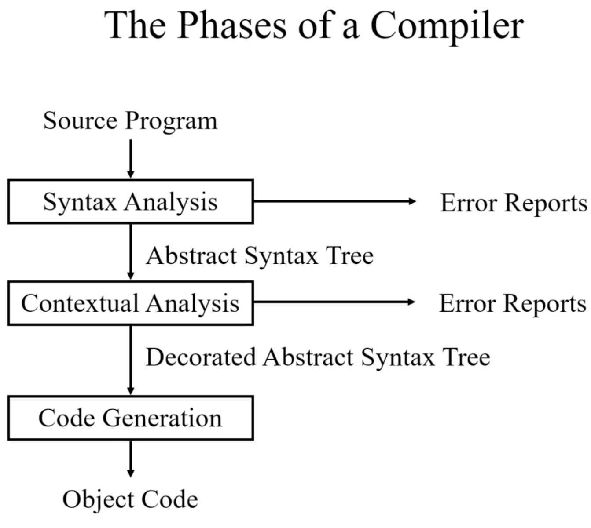

# Lecture 1

Criteria can be set for a programming language to see what is most important in a language. Here there is looked on readability, writability and reliability criterions.

Evidense based programming language design. This is a new direction. Where techniques are used as evidense to see what is good in a language, and what is not that good.

A well formed program is specified by the syntax and the contextual constraints (also called static semantics): scope rules and type rules.

### Language Processors

Editors: Emacs

IDE (Integrated Development Environments: IntelliJ, Rider, Visual Studio

Translators: compiler, assembler and disassembler

Interpreters: browser (html interpreter), sql database, java interpreter

## Compilation

Compilation is at least a two-step process, in which the original program (source program) is input to the compiler, and a new program (target program) is output from the compiler.

Compilers may generate any of the three types of code listed below

- Pure Machine Code - code for a particular machines instruction set without assuming the existence of any operating system or library routinesm it is called pure code because it includes nothing but instructions that are part of that instruction set. Mostly used in in compilers for system implementation languages, which are intended for implementing operating system or embedded applications.
- Augmented Machine Code - this code is augmented with operating system routines and runtime language support routines.The execution of a program generated by such a compiler requires that a particular operating system be present on the target machine and a collection of language-specific runtime support routines (I/O, storage allocation, mathematical functions, etc.)
- Virtual Machine Code - The ccode is composed entirely of virtual instructions.This can be run easily on a variety of computers. It is achived by writing an interpreter for the virtual machine. For example Java and the Java VM

Compilers also differs in the format of the target code they generate (page 7 in Crafting a compiler)

- Assembly or other source formats
- Relocatable binary
- Absolute binary

Generating high level code (like c code) from a compiler is called transpilation

The phases of a compiler can be seen in the picture below



The different phases can be seen as different transformation steps to transform source code into object code.

The different phases correspond roughly to the different parts of the language specification:

- Syntax analysis <-> Syntax
- Contextual analysis <-> Contextual constraints
- Code generation <-> Semantics (runtime semantics)

### Multi Pass Compiler

This compiler makes several passes over the program. The output of a preceding phase is stored in a data structure and used by subsequent phases.


### Single Pass Compiler

A single pass compiler makes a single pass over the source text, parsing, analyzing and generating code all at once. C compiler


## Interpreter

A different kind of language precessor. They execute programs without explicitly performing much translation.

To an interpreterm a program is merely data that can be arbitrarily manipulated, just like any other data.

Some languages have both interpreters and compilers (C, C++ and Java)

## Static Semantics

The static semantics of a language provide a set of rules that specify which syntactically legal programs are actually valid.

For example a strict language cannot add two different types of values together.

## Runtime Semantics

Specifies what a program computes, for example the semantics of the statement ```a = 1``` is that the state component corresponding to ```a``` is changed to ```1```.

There is a variety of formal approaches to defining the runtime semantics of programming languages. (page 12-13 in Crafting a compiler)

- Natural Semantics
- Axiomatic Semantics
- Denotational Semantics

## Organization of a Compiler

Can be read at page 15-19 in Crafting a compiler book


