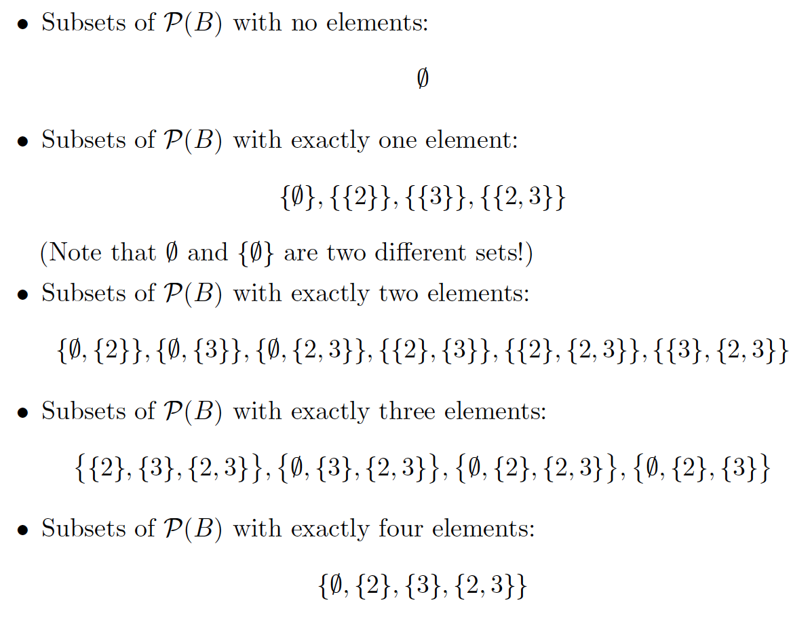

# Exercise Session 1

## Exercise 1

a) No, its false

b) Yes, as all elements found within B can also be found within A. B is a subset of A.

c) The realation is reflexive as all elemetns within B are found within A

d) $\{1, 2, 3\}$

e) Union

d) $\{2,3\}$

e) Intersection

f) $\{(1,2),(2,2),(3,2),(1,3),(2,3),(3,3) \}$

g) $\{Ø,\{2\},\{3\},\{2,3\}\}$

k) The number of elements in the power sets, so $2^n$ if there is n elements in E.

## Exercise 2

a) $ \{x \in \R|x+x > 8\}$

b) $\{x,y \in \R | x/2= y\}$

c) $\{x \in \N | x>0 \}$

## Exercise 3

a) No because 17 cannot map to y and z at the same time.

b) Yes it does, because it is a subset of the cartesian product between C and D

c) No, because $\{484\}$ is not in a relation with C AND D

d) Its only partial, because it needs to use 484

## Exercise 4

Base step:

k = 1

$$
1+ \sum^1_{i=1}(2i+1)=4

$$

$$
(1+1)^2=2^2=4

$$

Inductive step:

IH: That $1+\sum^k_{i=1}(2i+1)=(k+1)^2$ is true for k.

Now we show it is true for k+1

$$
1+\sum^{k+1}_{i=1}(2i+1)=((k+1)+1)^2

$$

Then we use the IH:

$$
(k+1)^2+(2k+2)=(k+1)^2+(2k+2)

$$

$$
k^2+2k+1+2k+2+1=(k+1)^2+(2k+2)

$$

$$
k^2+4k+4=(k+1)^2+(2k+2)

$$

$$
(k+2)^2=(k+1)^2+(2k+2)

$$

$$
(k+1)^2+(2k+2)=(k+1)^2+(2k+2)

$$

## Exercise 5

$$
\wp(\wp(B))= 2^{2^n}=2^{2^2}=16

$$

