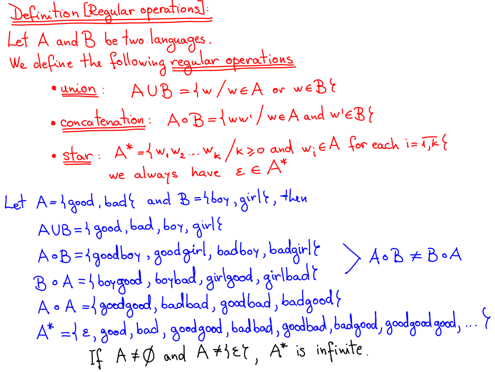

# Notes for Lecture 1**

An alphabet is a finite and nonempty set

A string over an alphabet is a sequence of the symbols in the alphabet, given the symbols are the members of the alphabet

The empty string (epsilon) is the string containing zero symbols.

|w| is the length of the word w

$w^R$ is the reverse of w

A prefix of a string is a substring placed in the leftmost of the side of w

A suffix of a string is a substring placed in the rightmost of the side of w

Concatenation is when you glue two strings together appending the first string to the second.

if the alphabet is ordered then the set of strings in $\sum^*$ can be ordered in lexicographic order

## Finite Automata

def: models of computers with extremely limited memory

It is a 5-tuple ($Q$, $\sum$, $\delta$, $q_0$, $F$), this is the mathematical representation of it:

- Q is a finite set called the **states**
- $\sum$ is a finite set called the **alphabet**
- $\delta:Q \times \sum \leftarrow Q$ is the **transition function**
- $q_0 \in Q$ is the **start state**
- $F \subseteq Q$ is the **set of accept states**

A finite automata has only one initial state but it might have more than one final state. It is possible that the initial state is also the final.

If A is the set of all the strings accepted by a finite Automata M, we say that F is the language of machine M.

$$
A=L(M)

$$

Proving languages for a finite automata is done by arguing, by showing a string from A is in L(M) and the other way.

If there is no final state the finite automata cannot accept any language.

### Computation

Let $M$ = ($Q$, $\sum$, $\delta$, $q_0$, $F$) be a finite automata and let $w = x_1, x_2, ... , x_k$ be a string where $x_i \in \sum$, $i = 1, 2 ... k$

Then M accepts w if there exist a sequence $r_0, r_1, ... r_k$ of states in Q (not  necessarily distinct) satisfying the following conditions:

1. $r_0 = \delta_0$
2. $\delta(r_i ,x_{i+1}=r_{i+1})$ for all $i=0,1,...,k-1$
3. $r_k \in F$

### Regular language

A language is regular if some finite automaton recognizes it.

### Regular operations

